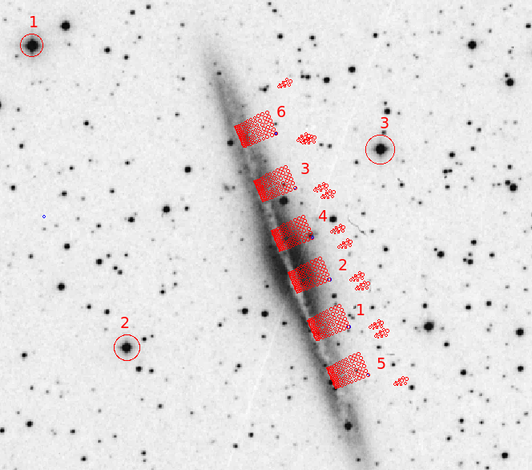
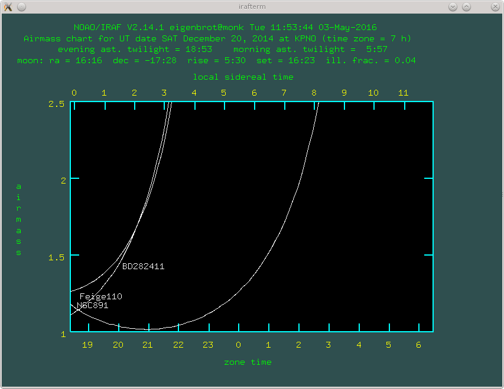
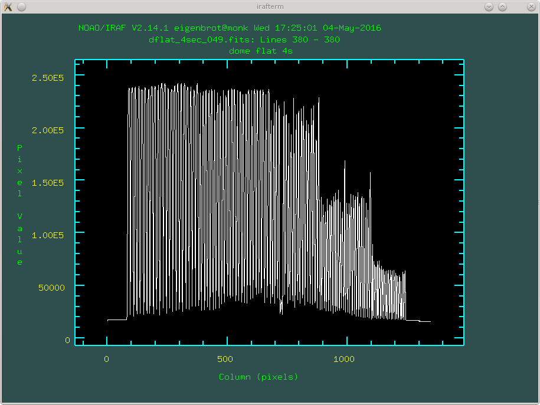
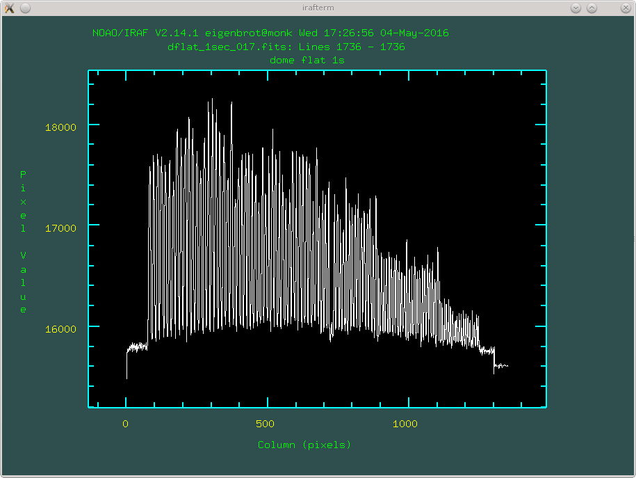
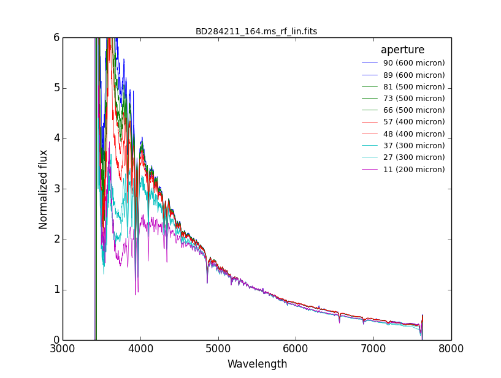
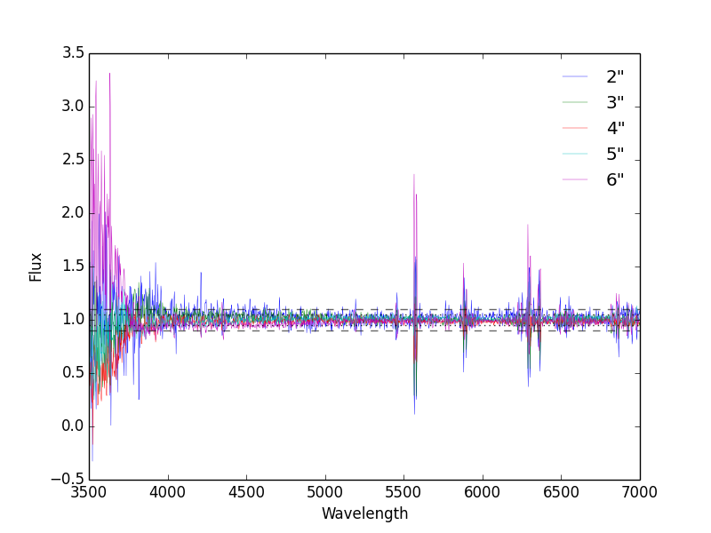

****************
Data Acquisition
****************

In this section I will describe some best practices for acquiring GradPak data
that will make your reductions much easier.

Pre-run Prep
============

One hour of WIYN time costs roughly $1,000. That means over a ten hour night
you are directly responsible for how efficiently $10,000 gets used. As an
Astronomer and a taxpayer I strongly urge you to show up to the telescope very
very prepared to maximize the amount of time WIYN spends soaking up data
photons. To get you started, here is a list of things you absolutely must have
by your first night:

Cache/Pointings
---------------

You probably want to actually put GradPak on an Astronomical object of some
sort. How are you going to do that? You'll need a cache file that you give to
your OA. This file contains one line for each thing you want to point to, each
with 4 columns corresponding to *name, RA, Dec, Epoch*. Here's how to find the
coordinates for the entire GradPak IFU:

 1. Open ds9 and grab an image of your object. Then use the
    gradpak_w_sky_comp.tpl template file to place the GradPak IFU on your
    object in all of the positions you want to observe. If you rotate the IFU
    note the angle given in the region information box. Fortunately this angle
    is exactly the position angle you will input to WIYN.

 2. Select a fiber in GradPak to be your "reference" fiber. I usually use
    fiber 105

 3. Find this fiber on IFU template and add circle regions that are perfectly
    concentric with the reference fiber. It is very important to get these
    centered exactly right because they are what will give you the coordinates
    of you IFU pointing. Use the dialog box in ds9 to get the coordinates for
    thes circles. 

 4. Give each pointing a name and write its information to the chache file.

As you might guess, the general idea is that the "position" of GradPak will
always be the location of the reference fiber. For this reason we also need
some bright stars to calibrate the offset between the default telescope
pointing and the reference fiber. You should have at least three bring stars
(brightness coming soon) that more-or-less evenly distributed around the
science pointings. Use ds9's catalog tools to find these stars and add them to
the cache (call them check1, check2, etc.).

When you're all done with this you should have a cache file that looks
something like this::

 #Rotator at 295.787 degrees E of N
 # coordinates are for fiber 105
 check1	       02:23:08.486 +42:25:58.22 2000
 check2	       02:22:54.082 +42:18:40.28 2000
 check3	       02:22:21.646 +42:23:47.58 2000
 NGC891_P1     02:22:24.819 +42:19:24.58 2000
 NGC891_P2     02:22:27.637 +42:20:33.36 2000
 NGC891_P3     02:22:32.718 +42:22:45.66 2000
 NGC891_P4     02:22:30.148 +42:21:33.66 2000
 NGC891_P5     02:22:21.994 +42:18:15.29 2000
 NGC891_P6     02:22:35.567 +42:24:04.38 2000

It is also a good idea to save all your ds9 regions so you can recal them
later as need. You've also generated a finding chart, which will be handy at
WIYN. See an example below:

     A finding chart from proposal 2014B-0456. I've labeled my six GradPak
     pointings for easy identification. The barely visible blue circles are
     the circles I used in step 3 above to find the location of the reference
     fiber (here #105). The three check stars I used are also clearly marked.

Standard Stars
--------------

Unless you *really* know for sure that you don't need standard stars you
should probably take some standard star observations each night. Your data
reduction will be much easier if you choose standard stars that are in the
IRAF database. This gives you two catalogs to choose from, the `IIDS Catalog
<http://www-kpno.kpno.noao.edu/Info/Caches/Catalogs/IIDS/iids_catalog.html>`_,
or `Massey's Spectrophotometric Standards
<http://www-kpno.kpno.noao.edu/Info/Caches/Catalogs/SpecPhot/specphot_catalog.html>`_. Both are fine and there's not a reason to favor one over the other.

You'll want a few O or B stars for good flux calibration (because they don't
have many spectral lines). The more you have the better your calibration will
be, but the less time you'll spend getting data photons; the classic Astronomy
tradeoff. Brighter is better because the exposures take less time, but you'll
probably be mostly limited by what stars are visible during your run. If at
all possible find some stars that are visible across most of the night (at
different airmasses) so you can try to get night-by-night extinction
curves. On my most recent proposal this was impossible, but maybe you'll get
lucky.

If using a star from one of the catalogs mentioned the OA's will have the
coordinates already. Still, I usually put the stars in my cache just for
completeness.

Airmass Charts
--------------

Airmass charts are crucial to planning out your nightly strategy; you'll want
to observe each object when it's at the lowest possible airmass (or at least
below 1.5). To generate these charts use **mtools.airchart**. The input file
has the same format as the cache (and could even be your cache file, although
that will probably clutter up the chart). You will also need to set the date
of the observation, but the default latitude and longitude are already set for
KPNO. Nice!

Below is an example airchart for 2014B-0456. Notice that I really needed to
jump on my two standard stars at the start of the night before moving to my
galaxy target. This is the kind of planning that only a good airmass chart can
provide.

     Airmass chart for December 20th, 2014. Based on this chart I spent from
     19:00 to 20:00 observing my two standard stars (BD282411 and Feige 110)
     before they got too low on the horizon. Fortunately right around this
     time the galaxy NGC 891 was hitting its minimum airmass, which made for
     some sweet observations. It would not have been worth observing NGC 891
     past about 1:30, but my program was over by 0:00 so this wasn't a
     problem.

Exposure Times
--------------

Hopefully you figured this out when you wrote your proposal, but if you're
like many WIYN astronomers you probably did a lot of handwaving. Now is the
time to stop waving your hands and crunch some numbers. Someday someone will
write a good recipe for computing accurate exposure times on the Bench
Spectrograph, but until then you'll have to figure it out yourself. Steve
Crawford's `bench simulator
<http://www.astro.wisc.edu/~crawford/Spectrograph/intro.html>`_ is a good
starting point. It is out of date regarding detectors, but the grating
equation never goes out of style.

Of course, you'll want to break up your exposure times into the smallest
chunks possible where you are still in the sky-limited noise regime. For a
setup with 2.1 AA per pixel this was around 30 min per exposure.

Ability to Quick Reduce Data
----------------------------

Finally, make sure you have read (and maybe even understand) the basic flow of
the :doc:`Data_Reduction` section. At the very least you should be able to do
a quick reduction of the previous night's data before starting a new
night. This way you can identify any problems like bad pointings, short
exposure times, etc. while you still have a chance to fix them. It is often
enough just to get through the **dohydra** step; flux calibration can wait.

Calibrations
============

Calibration frames are almost more important than the actual data; without
them you entire run will be worthless. At the very least you need:

 Darks: 10 darks per scientific exposure time per night is a good number. It's
 OK if you can't them every single night, but you should try to. Because the
 exposure times are long, it's common to run darks during the day while you're
 sleeping (set it up at the end of the night).

 Zeros: Get a ton of these. Waiting for twilight? Grab some zeros! Showed up
 before the OA? Grab some zeros! Get lots and lots of zeros.

Flats
-----

Getting proper flats with GradPak is different than other IFUs because the
multi-pitch nature of GradPak poses some unique light-collection
challenges. You may find that your spectrograph setup puts you in a position
where you can't get enough signal in the smaller fibers without saturating the
large fibers:

	 
   This flat has good signal in the smallest fiber (right side), but all of
   the large fibers are totally saturated. Not good.

If this is the case then you'll need to take multiple flat exposures to get
all fiber sizes with good signal. Deciding on what exposure times can be a
little tricky but as a generaly rule you want to always look at the brightest
part of the spectrum in the large fibers and the dimmest part of the spectrum
in the small fibers. To say it a different way, set your short exposure time
flats so that the large fibers are at the upper end of the linear regime in
the brightest part of the spectrum. Similarly, set your long exposure time
flats so that you get a good number of counts in the dimmest part of the
spectrum with the smallest fibers.

   This flat has good signal in the large fibers and does not saturate where
   the last image did (above), but there is not enough signal in the small
   fibers.

It is important to note that the non-linear regime is not the same as
saturating the detector; you encounter non-linearity before you saturate. This
threshold varies with gain and binning, but an easy way to check is divide two
flats with different exposure times. The resulting image should be constant
everywhere with the value of the ratio of the exposures times. In places where
there is structure you are in the non-linear regime.

In my limited experience it seems like the 2" and 3" fibers behave as the
"small" fibers and the 4", 5", and 6" fibers are the "large" fibers.

Having said all this, make sure you actually need multiple exposure times
before you go through the trouble. You might get lucky with your setup and be
able to get good signal in all fibers with a single exposure time. If so,
that's awesome.

Get a statistically significant number of flats for each exposure time you
need. That means at least 10.

Standard Stars
==============

Taking standar star observations is a relatively straight forward task; simply
park the star on one the fibers and expose until you get good signal. I am
often surprised how long it takes to get the proper number of photons, but a
minute or two is pretty typical. In a perfect world you would get light down
every single fiber so you could later do a fiber-by-fiber flux calibration,
but in practice you'll probably have to settle with getting a few fibers each
night.

BUT THERE IS A PROBLEM. The smallest GradPak fibers are really small. So
small, in fact, that they get affected by differential atmospheric refraction
(DAR). DAR causes light of different wavelengths to have slightly different
focus positions at the telescope focal plane. For older Paks this wasn't a
problem because the fibers were so big that all the light from each on-sky
position fell within the same fiber. Unfortunately, the 2" and 3" fibers are
small enough (~200 and 300 microns, respectively. AKA, pretty damn small) that
DAR causes some light to be lost off the edge of the fiber. Cruicially there
is a spectrum to this lost light (that's the very nature of DAR). In other
words, you might capture all of the light redward of 5000 AA, but start
loosing light off the side of the fiber at bluer wavelengths.

For observations of extended objects this isn't that much of an issue. DAR
just acts as (small) smearing kernel between you and the object. The light
that is lost from one position on the sky is replaced by light added from the
position right next to it.

The problem is that point sources get pretty messed up by DAR. The (wavelength
dependent) light they loose does not get replaced and the end result is an
artifical "DAR" spectrum imposed on top of the actual spectrum.

   A standard star observed through multiple fiber sizes. For this observation
   GradPak was dragged across the standard star to sample all 5 fiber
   sizes. The effects of DAR are clearly visible as the supression of the blue
   end of the spectrum in the 3" and 2" fibers (and a little bit in the 4"
   fibers).

Yikes, imagine if you used the 2" fiber above to do flux calibration. Your
data below 5000 AA would be completely wrong. Again, and this is very
important, DAR only affects point source observations, so it is not OK to
compute a "correction" from the above plot to apply to your small fibers.

So what can you do? This answer will vary based on exactly what you need
standard stars for, but I can tell you what I did. Every night I took standard
star observations in 3-4 6" fibers, changing the specific fibers each
night. In this way I built up a collection of standard star observations for
all of the fibers I know for a fact do not suffer from DAR. I then crossed my
fingers and applied the resulting flux calibrations to all the rest of the
fibers in the array. This is not so crazy: a good flat field calibration will
remove the *relative* spectral differences between the fibers, then a single
fiber (or group of fibers) can provide the *absolute* spectral calibration for
the entire IFU.

In fact, we can test how legit this is. The figure below compares the
absolute flux calibration across all fiber sizes. The data are taken
from a single galaxy frame that has gone through all reduction steps,
including flux calibration (but not sky subtraction). Each line
represents the average of all 4 sky fibers for a single fiber size and
all lines have been divided by the mean of *all* sky fibers. From this
we can see that the sky spectrum in all fiber sizes is the same to
within 5% for wavelengths > 4000 AA. Right around 4000 AA the 2" and
3" fibers deviate from the rest of the fibers by 10-20%, but this is
just at the limit of our "good" data range (the signal drops
precipitously at this point). All in all not too bad.

   A test of the absolute flux calibration across all fiber sizes when
   using standard star data from only 6" fibers. The data are taken
   from a single galaxy exposure that has been reduced through flux
   calibration, but skipping sky subtraction. Each line represents the
   average of all 4 sky fibers for a given fiber size and all lines
   are normalized by the mean of *all* sky fibers. The dotted and
   dashed lines show deviations at the 5% and 10% level,
   respectively. All fiber sizes show an absolute flux calibration
   consistent within 5% for wavelengths > 4000 AA. At 4000 AA the 2"
   and 3" fibers deviate by up to 20%.

It's important to note that for my actual observations I *did not* drag the
star across the IFU (as is common for many other IFUs). For each standard star
frame I placed the star in the center of a 6" and left it there the whole
time. If the star is near the edge of a large fiber DAR can still caused some
of the light to be lost.

Finally, I should note that it *should* be possible to beat the effects of DAR
with some clever maneuvering. DAR disperses the light along a line normal to
the horizon, i.e., azimuth. It should therefore be possible to drag the star
exactly along the azimuth axis so that any light lost at time *t* is regained
at *t* + epsilon. As long as the star starts and ends well off the IFU all the
light should be captured by all the fibers. I spent a twilight trying this
during my run and was uncessesful, which is not to say the method cannot
work. If you're feeling adventerous, go for it.
