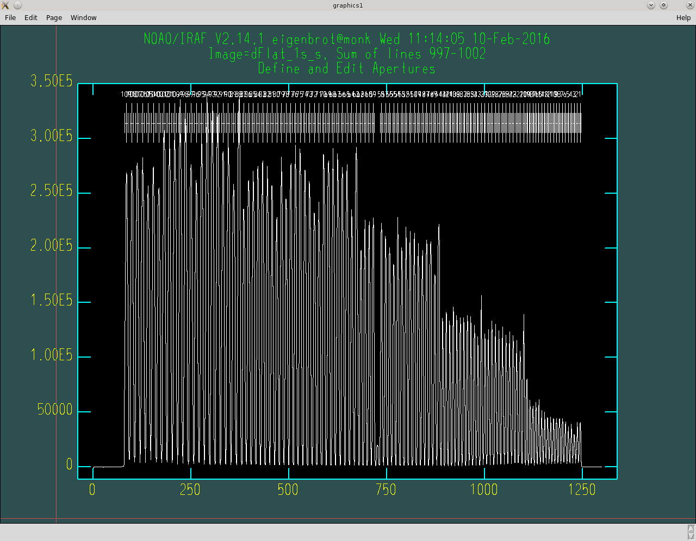
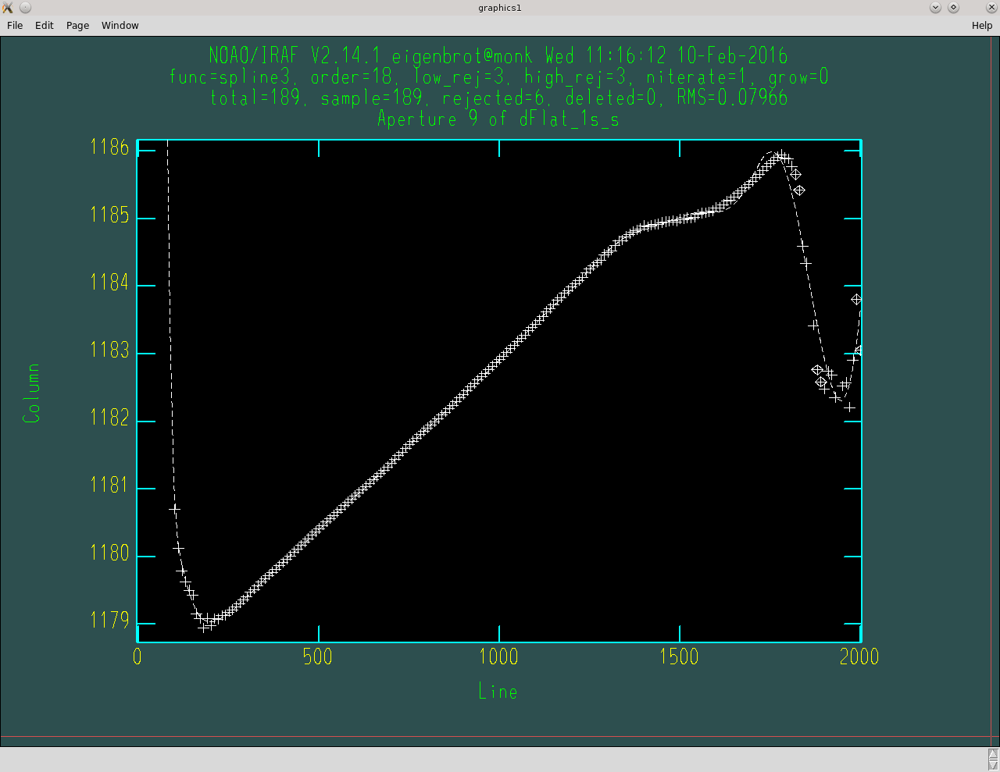

Data Reduction
**************

The best way to reduce GradPak data is with IRAF and the **dohydra**
package. If you are unfamiliar with the basics of IRAF or the general order
IFU reductions with **dohydra** take solace in the fact that failure often
leads to deeper understanding and forge ahead.

From a high-level viewpoint reducing GradPak data is no different than
reducing any other IFU data, be it any of WIYN's \*Paks, Hydra, PPak,
etc. etc. However, the unique, multi-pitch nature of GradPak introduces some
interesting and frustrating complications that require special mention. In
this guide I will breeze through aspects of reduction that are common to all
IFUs and focus on the specificities of GradPak reductions.

.. note:: Many of the concepts and steps mentioned below, while common to any
          IFU reduction, are taken from the Disk Mass Survey's SparsePak
          reduction recipe (link soon). I highly recommend you read this
          document at some point.

Below are the steps needed to go from raw frames from the bench to
flux-calibrated spectra ready for analysis. Steps in *italics* are
cruicially different for GradPak than any other IFU.

.. note:: Completing all the steps below will require the IRAF prompt as well
          as whatever Linux shell you use. I will use '[packagename]> ' to
          denote IRAF commands and '#> ' to denote shell commands.

1. Basic Reductions
===================

The first step is to prep your raw frames for **dohydra** this involves using
**ccdproc** to trim the images and do overscan, zero, and dark
corrections. You should also combine your flats (of the same exposure time)
and arc images to beat down the noise. At the end of this step you should have:

* A single arc-lamp frame
* A single dome flat frame for each exposure time taken
* All of your program frames (object, standard stars, etc.) that have been
  trimmed, overscan corrected, and zero and dark subtracted.

2. *Prepare Master Flat*
========================

Options
-------

If you took flats at multiple exposures to get good signal across all fiber
sizes then this step is cruicial. If not, skip ahead to the next step.

This step will combine your multiple flats together into a single 'master'
flat that can be used by **dohydra** to apply flat-field corrections to your
data. To do this we use :mod:`GradPak_flatfu`, which is pretty fancy.

See :mod:`GradPak_flatfu` for a detailed discussion of the method and options
available; the typical usage looks a lot like::

  > python GradPak_flatfu.py dFlat_4s.fits -t dFlat_1s.fits 43

This example illustrates some important descisions you will have to make based
on a careful examination of your data. The first is where you want the pivot
point to be. In the above example I chose fiber 43 so that the 2'' and 3''
fibers (1 - 43) will be taken from dFlat_4s.fits and the 4'', 5'', and 6''
fibers (44 - 109) are taken from dFlat_1s.fits. This makes sense because in my
spectrograph setup the 4'' fibers are in the non-linear regime (don't even ask
about the 5'' and 6'' fibers!) with a 4s dome flat exposure while the 2'' and
3'' fibers have dangerously low signal with a 1s exposure. This might not be
true for your data so make sure you choose a pivot point that works for you. I
cannot recommend pivoting around a fiber that is not at the border of two
fiber sizes.

.. note:: It is perfectly OK to have more than 2 different flat exposures (and
          more than one pivot point). See :mod:`GradPak_flatfu` for more
          information

The next thing you need to decide is which flat to use for doing the aperture
traces. Make sure it's a good one because the resulting traces will be used
for *all* of your data (as they should be). By default, *GradPak_flatfu* will
use the first flat as the trace flat, but this is often non-ideal. In the
above example I used the *-t* flag to force *GradPak_flatfu* to use
dFlat_1s.fits as the trace flat. In my case I first tested the traces of each
flat and found that the 1s exposure flat produced trace fits that were cleaner
than the 4s flat, most likely due to the wonky shape of super-saturated larger
fibers. I highly recommend you do similar tests and decide for yourself which
flat produces better traces.

Next, you have the option of specifying a *throughput* image that is used to
make fiber-to-fiber corrections after extraction. Basically what IRAF does is
extract the throughput image, sum each fiber along the dispersion axis, and
apply a correction to normalize these sums. I strongly recommend **NOT**
applying this correction because:

1. Because of the multiple fiber sizes in GradPak this will, in principle,
   take your measured surface brightnesses and turn them into total intensity,
   which might confuse you later when you wonder why some fibers are way
   brighter than others.

2. IRAF doesn't even do step 1. right. Because of some rigidity in the way
   aperture traces are computed there will not be the simple (2:3:4:5:6)^2
   ratio in brightness you might expect from the fiber sizes.

3. Any variation in the throughputs of the fibers should already be captured
   and corrected by the dome flats. GradPak is small enough on the sky the the
   WIYN flat lamps should do a pretty darn good job approximating uniform
   illumination. Are you *sure* you want to use a throughput image?

All that said, if you *really* want to use a throughput image just precede it
with the *-r* option.

Finally, you have a choice to remove the average flat spectrum from the master
flat. This option is on by default. If selected each spectral channel of the
master flat is divided by the average of that channel over all fibers. Because
GradPak has multiple fiber sizes this step will not completely eliminate the
spectral signature of the flat lamps, but it will greatly decrease it. At the
end of the day this option is largely a matter of preference because flux
calibration will remove the average flat spectrum anyway. If you want to keep
the average flat spectrum for whatever reason you can turn off this option
with the *-nf* option.

Setting up **dohydra** parameters
---------------------------------

:mod:`GradPak_flatfu` uses the *HYDRA* package extensively and is highly
dependent on the parameters you set for *HYDRA* and **dohydra** in IRAF. To
access the global *HYDRA* parameters make sure you've loaded the *HYDRA*
package and type::

  hydra> epar params

Many of these can be left as the default, but pay special attention to the
TRACE PARAMETERS and ARC DISPERSION FUNCTION PARAMETERS. You can change these
interactively as you fit, but after a few iterations you can save yourself
some keystrokes by setting the defaults here. More important are the
**dohydra** parameters::

  hydra> epar dohydra

Leave the first section blank for now (it will be filled in by
:mod:`GradPak_flatfu`). Make sure your readnoise and gain are correct (this
info is in the FITS header). *Fibers* should be 109 and make sure *apidtab =
gradpak_sizes.iraf* (this is crucial for proper sky subtraction). 

The *width* parameter is very important for aperture extraction. Before you
set this open up one of your flat images (preferably the one that will be
traced) with **implot** or **imexam** and measure the width of the 6'' fibers
(along the spatial dimension). These fibers probably won't have gaussian
profiles, but use the FWHM provided and your best judgement to determine an
appropriate *width* value.

The rest of the parameters are not relevant for this step and will be covered
in below.

Running :mod:`GradPak_flatfu`
-----------------------------

From a user perspective, running :mod:`GradPak_flatfu` is identical to using
the aperture identification and extraction parameters in the *HYDRA*
package. The first step is to identify all 109 GradPak apertures. I have never
had to adjust the aperture locations presented by IRAF, so if you find
yourself doing this you probably have some parameters set to wonky
values. Make sure you get all the way to 109 on the right side and that the
visible, but obviously broken fiber falls between 58 and 59.

    Example of aperture identification. Your plot should not look very different from this.

The next step is to fit the aperture traces. I was fortunate enough to have a
spectragraph setup that made this process a real pain in the ass, but maybe it
will be really easy for you. The end goal is to give each aperture a trace
that fits the data reasonably well. For me this meant going through all 109
apertures and adjusting the fit parameters manually to get good fits and
consistent end behavior. That last point is an important one; if you have low
signal at one end of your spectrum (probably the blue) you might find that the
same fit parameters cause one aperture to swing wildly up at this end while
the next aperture swingly wildly down. This doesn't really make physical sense
and should be avoided.

    Example of fitting an aperture trace. Note the high order fit. I often
    have to change the fit order considerably from aperture to aperture.

Even if you get lucky and can fit all your apertures well with the same fit
parameters I highly recommend monitoring the fits of all apertures at least
once before you push that big 'NO' button.

Once all the aperture tracing is done you'll see a few messages about
normalization and shutter correction and then the program will exit. Upon
completion :mod:`GradPak_flatfu` also sets all of your **dohydra** parameters
to be correct for the next step, which is where you should go now.

.. note:: :mod:`GradPak_flatfu` uses the same database as IRAF for storing
          aperture traces, wavelength solutions, etc. This defaults to a
          folder called "database" in the current directory. This means if you
          mess up some aperture traces you'll have to delete the
          "database/ap*" file to start again. That said, if you just need to
          rerun :mod:`GradPak_flatfu` for any reason (different basic
          reductions or something) then you can totally skip the aperture
          fitting step if the database still exists. Very nice.

3. Run **dohydra**
==================

4. *Sky Subtraction*
====================

Now that you have wavelength calibrate data and have resampled your spectra
onto a common wavelength scale you can get rid of that pesky sky signal. To do
so you will use :mod:`GradPak_skysub`. Torun it simply use ::

 > python GradPak_skysub.py INPUT_FILE.ms_lin.fits [INPUT_FILE.ms_s_lin.fits]

The syntax above is just a suggestion. You can call your outputfile whatever
you want. If you choose to stick to the naming convention used throughout this
document then :mod:`GradPak_skysub` will take a \*.ms_lin.fits file and
automatically give it a \*.ms_s_lin.fits suffix.

Using :mod:`GradPak_skysub` is identical to *HYDRA*'s **skysub** routine. In
face, all :mod:`GradPak_skysub` does is run **skysub** five times; one for
each fiber size.

.. warning: For :mod:`GradPak_skysub` to work you *must* have run **dohydra**
   with *apidtab=gradpak_sizes.iraf*

For each fiber size you will be presented with an IRAF plot of the 4 sky
fibers. In these plots you can delete specific fibers with the 'd' key (use
'r' to redraw the plot after you do this). Once you are satisified with the
selection of sky fibers hit 'q' to be taken to the next fiber size. Once all 5
sizes are done the output file will be generated and you're done!

5. Flux Calibration
===================
